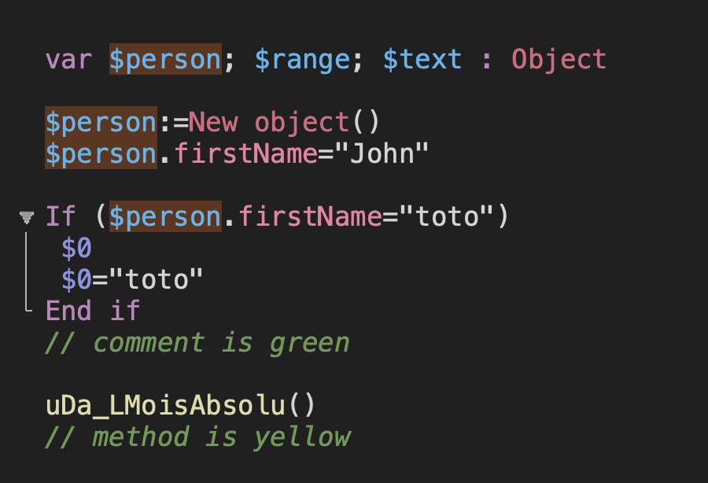

# vscode-4d-theme dark

Make your 4D editor pretty



## Change theme

Select it in 4D v19+ [preferences](https://developer.4d.com/docs/en/Preferences/methods.html#themes).

## How to install


### On macOS

Open a terminal you can type

```bash
curl -sL https://raw.githubusercontent.com/matthieu-kozicki/vscode-4d-theme/main/vscode-dark-theme.json -o $HOME/Library/Application\ Support/4D/4D\ Editor\ Themes/vscode-4D-theme-dark.json
```

## Others

[Other 4D Editor Themes](https://github.com/topics/4d-theme)